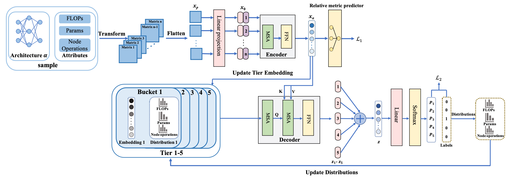

# Clasificador de Arquitecturas Neuronales

Este repositorio contiene la implementación en PyTorch del NAR, que incluye:

* código de entrenamiento y código de muestreo para el NAR.
* conjuntos de datos detallados de información de celdas basados en NAS-Bench-101 y NAS-Bench-201.
* código de codificación de arquitecturas.



## Conjuntos de datos de información de celdas

1. Información de celdas para NAS-Bench-101

    El conjunto de datos original [NAS-Bench-101](https://github.com/google-research/nasbench) contiene 423.624 redes neuronales basadas en celdas únicas y cada red se entrena y evalúa en CIFAR-10 durante 3 veces. Cada red se representa mediante grafos acíclicos dirigidos (DAG) con hasta 9 vértices y 7 aristas. Las operaciones válidas en cada vértice son "3×3 convolution", "1×1 convolution" y "3×3 max-pooling".
  
    Calculamos los *FLOPs y #parámetros* para cada **vértice (operación)** de cada celda para todas las arquitecturas. La precisión de entrenamiento, validación y prueba, así como el tiempo de entrenamiento, son promedios de 3 ejecuciones de 108 épocas.

    El conjunto de datos está en formato `json` y un ejemplo se encuentra en `data/nasbench101_vertice_example.json`. El conjunto de datos completo que contiene 423.624 redes está disponible en [Google Drive](https://drive.google.com/file/d/1hM_wZzkI79tkacl3YL42ZZFAuldmGip5/view?usp=sharing) (717 MB), el SHA256 del archivo json es `ff051bbe69e50490f8092dfc5d020675ed44e932d13619da0b6cc941f77b9c32`.

2. Información de celdas para NAS-Bench-201

    El conjunto de datos original [NAS-Bench-201](https://github.com/D-X-Y/NAS-Bench-201) contiene 15.625 redes basadas en celdas únicas, entrenadas y evaluadas en CIFAR-10, CIFAR-100 e ImageNet-16-120. Cada red se representa mediante un DAG con 4 vértices y 5 aristas. Diferentemente, cada arista está asociada con una operación válida y cada vértice representa la suma de los mapas de características. Las operaciones válidas son "zeroize", "skip connection", "1×1 convolution", "3×3 convolution" y "3×3 average-pooling".

    Calculamos los *FLOPs y #parámetros* para cada **arista (operación)** de cada celda para todas las arquitecturas entrenadas en CIFAR-10, CIFAR-100 e ImageNet-16-120 durante 200 épocas, respectivamente.

    El conjunto de datos está en formato `json` y un ejemplo se encuentra en `data/nasbench201_vertice_example.json`. El conjunto de datos completo que contiene 15.625 redes está disponible en [Google Drive](https://drive.google.com/file/d/1MeYtWM2n-ZlUDvDyvby1lVj3hA71kZ28/view?usp=sharing) (68 MB), el SHA256 es `e462fa2dbff708a0d8e3f8c2bdcd5d843355d9db01cb62c5532331ad0b8ca7af`.

## Codificación de arquitecturas

La codificación de la arquitectura sigue el método de tensor de características propuesto en [ReNAS](https://arxiv.org/abs/1910.01523). Publicamos la implementación aplicada a nuestros conjuntos de datos de información de celdas.

Para NAS-Bench-101, cada red se codifica en un tensor de 19×7×7, que incluye una **matriz de tipo de operación de vértice**, **matriz de FLOPs** y **matriz de #parámetros** para cada celda (9 celdas en total) de todas las arquitecturas, con un tamaño de 7 para cada matriz. En el caso de que los vértices sean menos de 7, se aplica relleno con ceros a las filas y columnas correspondientes. El código se encuentra en `architecture/arch_encode.py`.

Para NAS-Bench-201, cada red se codifica en un tensor de 31×4×4 de la misma manera que con NAS-Bench-101. Dado que cada vértice representa la suma de los mapas de características y está fijo en 4, cada tamaño de parche tiene un tamaño fijo de 4 como resultado. El código se encuentra en `architecture/arch_encode_201.py`

## Entrenamiento y búsqueda

Tomemos el entrenamiento y la prueba en NAS-Bench-101 como ejemplo:

1. Para entrenar el NAR en NAS-Bench-101, modifique la configuración de los experimentos y los hiperparámetros en el archivo `config.yml` ubicado en el directorio `./config` y ejecute:

    ```bash
    python train.py --config_file './config/config.yml' --data_path './data/nasbench101/nasbench_only108_with_vertex_flops_and_params.json' --save_dir './output'
    ```

2. Para probar el NAR en NAS-Bench-101, ejecute:

    ```bash
    python test.py --config_file './config/config.yml' --data_path './data/nasbench101/nasbench_only108_with_vertex_flops_and_params.json' --save_dir './output/trained_model_dir' --checkpoint 'trained_model_ckp_name'  --seed 77777777 --save_file_name 'test.log'
    ```
