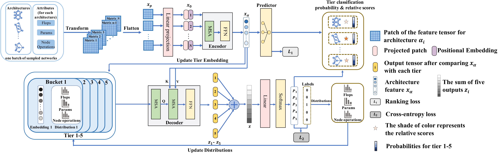

# Neural Architecture Ranker

This repository contains PyTorch implementation of the NAR, including:

* training code and sampling code for NAR.
* detailed cell information datasets based on NAS-Bench-101 and NAS-Bench-201
* architecture encoding code.

painter gm_oct

## Cell information datasets

1. Cell information for  NAS-Bench-101

    The original [NAS-Bench-101](https://github.com/google-research/nasbench) dataset contains 423,624 unique cell-based neural networks nad each network is trained and evaluated on CIFAR-10 for 3 times. Each netowrk is represented by directed acyclic graphs (DAG) with up to 9 vertices and 7 edges. The valid operations at each vertex are "$3\times3$ convolution", "$1\times1$ convolution", and "$3\times3$ max-pooling".
  
    We calculate the *FLOPs and #parameters* for each **vertice (operation)** of each cell for all the architectures. The training, validation and testing accuracy, as well as the training time, are averaged from 3 runs of 108 epochs.

    Dataset is in `json` format and an example is in `data/nasbench101_vertice_example.json`. Full dataset containing 423,624 networks is available from [Google Drive](https://drive.google.com/file/d/1hM_wZzkI79tkacl3YL42ZZFAuldmGip5/view?usp=sharing) (717MB), the SHA256 of the json file is `ff051bbe69e50490f8092dfc5d020675ed44e932d13619da0b6cc941f77b9c32`.

2. Cell information for NAS-Bench-201

    The original [NAS-Bench-201](https://github.com/D-X-Y/NAS-Bench-201) dataset contains 15,625 unique cell-based networks, trained and evaluated on CIFAR-10, CIFAR-100 and ImageNet-16-120. Each network is represented by DAG with 4 vertices and 5 edges. Differently, each edge is associated with a valid operation and each vertice represents the sum of the feature maps. The valid operations are "zeroize", "skip connection", "$1\times1$ convolution", "$3\times3$ convolution", and "$3\times3$ average-pooling".

    We calculate the *FLOPs and #parameters* for each **edge (operation)** of each cell for all architectures trained on CIFAR-10, CIFAR-100, and ImageNet-16-120 for 200 epochs, respectively.

    Dataset is in `json` format as well and an example is in `data/nasbench201_vertice_example.json`. Full dataset containing 15,625 networks is available from [Google Drive](https://drive.google.com/file/d/1MeYtWM2n-ZlUDvDyvby1lVj3hA71kZ28/view?usp=sharing) (68MB), the SHA256 is `e462fa2dbff708a0d8e3f8c2bdcd5d843355d9db01cb62c5532331ad0b8ca7af`.

## Architecture encoding

The architecture encoding follows the feature tensor method proposed in [ReNAS](https://arxiv.org/abs/1910.01523). We release the implementation applied to our cell information datasets.

For NAS-Bench-101, each network is encoded into a tensor of $19\times7\times7$, including one **vertice operation type matrix**, **FLOPs matrix** and **#parameters matrix** for each cell (total 9 cells) of all architectures with each matrix size of 7. For the case that vertices are less than 7, zero padding is applied to the corresponding rows and columns. Codes are in `architecture/arch_encode.py`.

For NAS-Bench-201, each network is encoded into a tensor of $31\times4\times4$ the same way with the NAS-Bench-101. Since each vertice represents the sum of feature maps and is fixed as 4, each patch size has a fixed size of 4 as a result. Codes are in `architecture/arch_encode_201.py`

## Train and search
